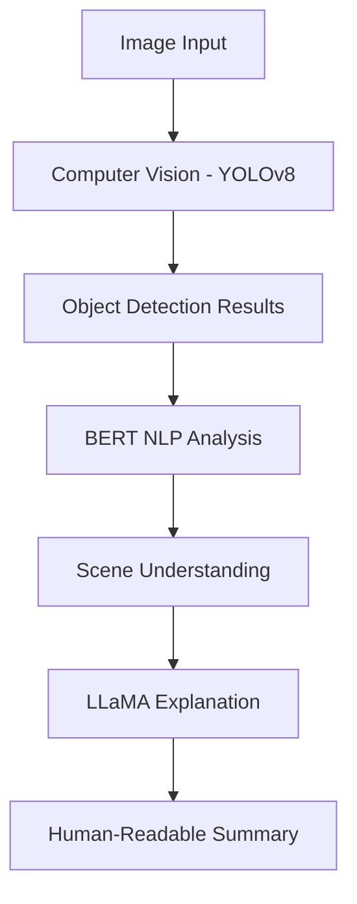

# Multimodal Visual Scene Understanding System
uvicorn app:app --reload
A Multimodal AI System using Computer Vision, BERT, and LLaMA for visual scene understanding and explanation.
BACKEND ARCHITECT
## System Architecture



## Tech Stack

### Backend
- **Framework**: FastAPI
- **Computer Vision**: YOLOv8 (Ultralytics)
- **NLP**: BERT (HuggingFace Transformers)
- **LLM**: LLaMA 3.2 (via ctransformers)
- **Deployment**: Render

### Frontend
- **Framework**: React + Vite
- **UI Library**: shadcn/ui + TailwindCSS
- **State Management**: React Query
- **Routing**: React Router
- **Deployment**: Vercel

## Deployment Instructions

### Backend (Render)

1. Fork this repository to your GitHub account
2. Create a new Web Service on Render
3. Connect your forked repository
4. Configure the service with:
   - **Build Command**: `pip install -r requirements.txt`
   - **Start Command**: `uvicorn app:app --host 0.0.0.0 --port $PORT`
   - **Environment**: Python
5. Add environment variables if needed
6. Deploy!

The backend will be available at a Render-generated URL (e.g., `https://your-app-name.onrender.com`)

### Frontend (Vercel)

1. Fork this repository to your GitHub account
2. Create a new Project on Vercel
3. Import your forked repository
4. Configure the project with:
   - **Framework Preset**: Vite
   - **Build Command**: `npm run build`
   - **Output Directory**: `dist`
5. Add environment variables:
   - `VITE_API_URL` = `https://your-render-backend-url.onrender.com`
6. Deploy!

The frontend will be available at a Vercel-generated URL (e.g., `https://your-project-name.vercel.app`)

## Development Setup

### Backend

```bash
cd backend
pip install -r requirements.txt
uvicorn app:app --reload
```

### Frontend

```bash
cd frontend
npm install
npm run dev
```

## API Endpoints

- `GET /health` - Health check
- `POST /cv/detect` - Object detection
- `POST /scene/analyze` - Scene analysis
- `POST /scene/explain` - Natural language explanation

## Logging

The application logs scene analysis data for potential future training. In development, logs are written to `data/scene_logs.jsonl`. In deployment, logs are sent to stdout and can be viewed in the Render dashboard. See `DEPLOYMENT_LOGGING.md` for details.

## Environment Variables

### Backend
- `MODEL_PATH` - Path to YOLO model (optional)

### Frontend
- `VITE_API_URL` - Backend API URL (defaults to localhost in development)

## Contributing

1. Fork the repository
2. Create your feature branch
3. Commit your changes
4. Push to the branch
5. Open a pull request

## License

This project is licensed under the MIT License.